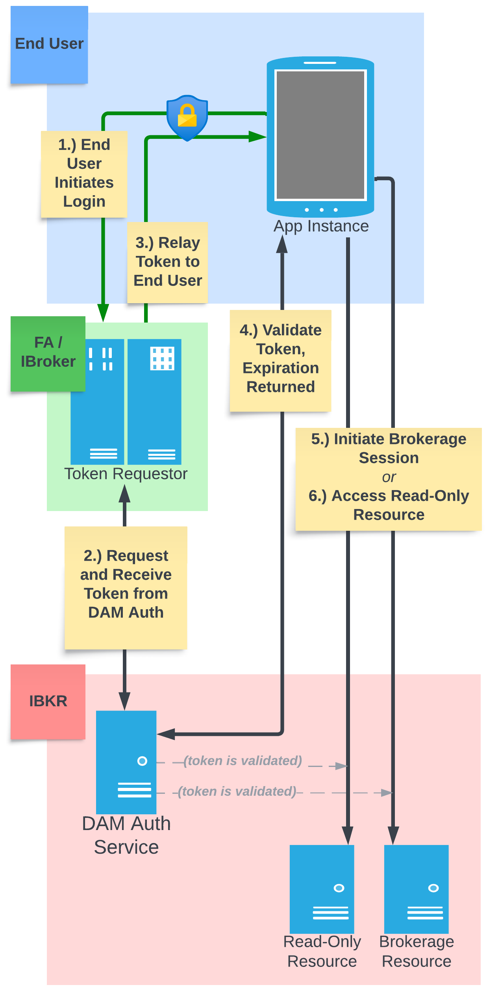

# DAM SSO Authentication <br>for the Client Portal Web API

## Summary

The DAM SSO authentication workflow permits the master level of a multilevel account structure (e.g., financial advisor or introducing broker account structure) to obtain authorization tokens on behalf of their managed accounts, which can then be used by instances of a client-facing application to make requests directly to IB's Client Portal Web API infrastructure. 

## Note regarding "session" terminology

References to sessions refer to a username that is authenticated and in contact with IB's backend infrastructure by one means or another, and is thus able to interact with the accounts for which it has permissions.

Access to IB account functionality is governed by usernames ("credentials"), regardless of the platform (TWS, Client Portal Web API, or otherwise). When a username authenticates with a platform, we say generally that the username has opened a session. This session grants the logged-in platform the ability to make use of some or all permissions and features carried by the authenticated username. 

In the context of the Client Portal Web API, sessions are two-tiered, with the second tier dependent on the first:

1. The first tier is a "read-only session", equivalent to logging into the Client Portal website for account management purposes but without trading permissions.

2. The second tier is the "brokerage session", to be established after the read-only session is active. This session permits trading functionality and consumption of market data, among other features. Web API endpoints with `/iserver` in the path are accessible only in brokerage sessions. A brokerage session is not required if `/iserver` endpoints aren't used. 

Note that a single username can only have one brokerage session active at a time. Additionally, market data subscriptions are tied to usernames, not accounts, so production usernames must carry their own subscriptions and cannot share. 

<div style="page-break-before: always;"></div>

## DAM SSO motivation

Consider an example use case:

A bank maintains a financial advisor structure with IB and wants to present intraday portfolio performance data to accountholders in their existing banking mobile app. Two approaches to obtaining this performance data via the Client Portal Web API are possible:

1. Make requests from the master level of the account structure for the given subaccount and return the data to the end user's mobile app

2. Make requests directly to IB from the end user's mobile device, using their (subaccount) credentials

The first approach is undesirable for several reasons. First, it requires the bank to build infrastructure to receive requests from mobile devices and relay those via the CP Web API to IB, and in turn to deliver the response back to the mobile devices. Second, CP Web API requests to IB are authorized using FA master level credentials, which introduces a bottleneck as all portfolio data must be funneled through the master level's CP Web API session. In large account structures, a master user may find that pacing limitations imposed on a single Web API session limit their ability to make requests fast enough to satisfy all of the downstream users. Third, by funneling requests through a single master level session, IB's load balancing and geographic routing are sidestepped; from IB's perspective, all requests for data will originate from a single source. 

The second approach is therefore the more scalable and efficient way to deliver portfolio data to instances of the bank's mobile app. However, this introduces a problem of authentication of Web API requests: How does an end user gain access to their IB account from within the bank's mobile app, such that the app can send and receive authenticated Web API requests? We assume that clients have already logged into the app on their phone using their banking credentials, so it is also not desirable to require clients to subsequently enter their IB credentials to gain access to Web API resources.

DAM SSO offers a workflow wherein the bank will act as a token-requestor intermediary on behalf of their client, leveraging both their formal permissions as managers of the client's account and the fact that the end user of the mobile app has already been authenticated and authorized by the bank. In this way, DAM SSO allows the bank to seamlessly grant a client the ability to make Web API requests for their own  account, without requiring the client to interact with IB credentials or do any prior configuration. Once a token is obtained and delivered to the end user's mobile device, the mobile device can make requests directly to IB without the bank's continued involvement.

<div style="page-break-before: always;"></div>

## Summary of DAM SSO workflow

*(Prerequisite configuration by IB's Sales Engineering team) You provide us with a public PGP key and a list of whitelist of master-level IP addresses from which you will initiate token requests.*

1. <u>End user's device makes request to master for a token</u>
   An end user opens your app and triggers a request to your infrastructure, indicating they'd like to access IB account resources that would require a Client Portal Web API session.

2. <u>Master requests and receives the token from IB</u>
   You send a request to IB on behalf of the end user, from one of your whitelisted IPs, that delivers (encrypted) information about the end user session that you're trying to create. This initial request delivers a payload containing the end user's IB username and their IP address -- the IP address from which the client's requests will subsequently originate. This end user IP is only used to validate future requests coming from that instance of your application, to ensure they are originating where they should be. 
   IB responds to your request with bearer token. This token is issued for use only by the provided username in future requests to the Web API originating from the provided end user IP address. 

3. <u>Master relays token to end user's device</u>
   You pass the this bearer token to the requesting end user's app.

4. <u>End user's device validates the token</u>
   The end user's app presents this token to the CP Web API for validation. We verify that it is valid, active, and arrived from the expected IP address. If verified successfully, the end user's app can proceed to make calls to any non-`/iserver` endpoint using this bearer token. At this stage, the end user has opened a **read-only session** and can continue to make requests directly to CP Web API resources.

5. <u>End user's device opens a brokerage session (Optional)</u>
   To open a brokerage session and access `/iserver` endpoints, the end user's app must make one additional request to `/ssodh/init`. The bearer token is included in this request as in all others. Read-only resources (without `/iserver` in the URL) are accessible with or without a brokerage session.

<div style="page-break-before: always;"></div>

## Lifetimes of sessions and DAM SSO tokens

Obtaining a DAM SSO bearer token on behalf of client establishes a read-only session for that client. A brokerage session requires a DAM SSO token, but the two sessions are not identical. In particular, a DAM SSO bearer token will remain valid for up to 60 minutes regardless of activity, while a brokerage session will be closed if it is unused (no requests made) for 5 minutes. The Web API's `/tickle` endpoint can be used to keep a brokerage session alive, and we recommend calling it every minute. Closure of a brokerage session does not invalidate a DAM SSO token, and the read-only session will persist. A new brokerage session can be opened using the existing DAM SSO token. A DAM SSO token's session lifetime can also be extended prior to its expiration. If a token expires, the master user can simply obtain a new one for the end user.

## Onboarding and configuration

Use of DAM SSO requires configuration by our Sales Engineering team (dam@ibkr.com). You will provide them with a public PGP key and a whitelist of master IP addresses from which token requests will originate.

DAM SSO bearer tokens can only be obtained in a production environment, either by live master usernames or their associated paper usernames. DAM SSO cannot be used with standalone demo accounts, so an IB account structure must exist before this configuration can be undertaken.

<div style="page-break-before: always;"></div>



<div style="page-break-before: always;"></div>

## DAM SSO token request workflow details

### 1.) End user's device makes request to master for a token

*To be handled securely between the master-level infrastructure and the end user's device.*

### 2.) Master requests and receives the token from IB

POST https://www.clientam.com/sso/dam/token

This POST request must contain a JSON body in the following format:

```json
{"csid":"$csidIssuedByIB","payload":"$encryptedPayload"}
```

The `payload` key's value, represented above as `$encryptedPayload`, will deliver the client username and client device IP address for which the token is being requested. To produce this `$encryptedPayload` value, you will first construct a plaintext JSON-formatted string in the following form, replacing `$clientUsername` and `$clientIPAddress` as appropriate:

```json
{"CREDENTIAL":"$clientUserName","IP":"$clientIPAddress","CONTEXT":"CP_API"}
```

The above string will then be:

1. Encrypted using the public PGP key provided by our Sales Engineering team (i.e., the key belonging to IB as the recipient of this encrypted message)

2. Signed using your own private PGP key (i.e., the key used to generate the public key which you provided to the Sales Engineering team during onboarding)

3. After encryption, base64-encoded with line breaks removed

<u>*Example using the Linux gpg tool:*</u>

```shell
echo '{"CREDENTIAL":"$clientUserName","IP":"$clientIPAddress","CONTEXT":"CP_API"}' \
    | gpg -u $yourKeyIdentifier -r $publicIBKeyIdentifier --sign --encrypt \
    | base64 --wrap 0
```

The output yielded by this process is the `$encryptedPayload` value assigned to the `payload` key in the request body. The output must be treated as a JSON string and wrapped in double quotes in the JSON body of the request, as shown above.

<u>*Example unencrypted payload string:*</u>

```json
{"CREDENTIAL":"abcde1234","IP":"1.2.3.4","CONTEXT":"CP_API"}
```

<u>*Example encrypted, base64-encoded payload string:*</u>

```
hQIMA4QK6XY...a6EOPAk5WY=
```

<u>*Example request:*</u>

```console
curl 'https://www.clientam.com/sso/dam/token' \
--request POST \
--header "Accept: application/json" \
--header "Content-type: application/json" \
--data '{"csid": "F86B0...129F", "payload": "hQIMA4QK6XY...a6EOPAk5WY="}'
```

<u>*Response:*</u>

```json
{"ACCESS_TOKEN":"$longToken","TOKEN_TYPE":"Bearer","RESULT":true}
```

### 3.) Master relays token to end user's device

*To be handled securely between the master-level infrastructure and the end user's device. After this step, the end user's device can proceed independently, and the master-level infrastructure is no longer required to be involved.*

<div style="page-break-before: always;"></div>

### 4.) End user's device validates the token

GET https://api.ibkr.com/v1/api/sso/validate

<u>*Request:*</u>

```console
curl 'https://api.ibkr.com/v1/api/sso/validate' \
--header "Authorization: Bearer $longToken"
```

<u>*Example response:*</u>

```json
{"PAPER_USER_NAME":"abcde1234","LOGIN_TYPE":2,"LANDING_APP":"UNIVERSAL","IS_PENDING_APPLICANT":false,"SF_ENABLED":false,"AUTH_TIME":1666709248942,"CREDENTIAL":"abcde1234","SF_CONFIG":"","USER_NAME":"abcde1234","CREDENTIAL_TYPE":0,"RESULT":true,"IS_FREE_TRIAL":false,"IP":"1.2.3.4","USER_ID":12345678,"EXPIRES":1666711150728,"TOKEN":"eyJ0eXAiO...fz3Hrqyyw","took":101,"IS_MASTER":false,"features":{"alpha":true,"env":"PROD","ibamWidget":true,"debugMenu":true,"record":true,"wlms":true,"realtime":true,"bond":true,"optionChains":true,"calendar":true,"newMf":true}}
```

### 5. End user's device opens brokerage session (Optional)

POST https://api.ibkr.com/v1/api/iserver/ssodh/init?compete=true&publish=true

**Both query parameters are required with value *true*.** Parameter `compete=true` permits this new brokerage session to terminate any existing sessions for the username on other platforms.

<u>*Request:*</u>

```console
curl 'https://api.ibkr.com/v1/api/iserver/ssodh/init?compete=true&publish=true' \
--request POST \
--header "Authorization: Bearer $longToken"
```

<u>*Example response:*</u>

```json
{"authenticated":true,"competing":false,"connected":true,"message":"","MAC":"F4:03:43:DC:90:80","serverInfo":{"serverName":"JisfN8122","serverVersion":"Build 10.20.0w, Apr 5, 2023 7:42:15 AM"},"fail":""} 
```

<div style="page-break-before: always;"></div>

## Further requests

*After step #5 above, the end user can access both read-only and brokerage functionality in their account(s), and they are also able to independently extend the lifetime of their token prior to its expiration.*

### 6. End user device makes request to any other Web API resource

Same as step #3 above. Requests must include the bearer token in the authorization header as `Authorization: Bearer $longToken`. As mentioned, `/iserver` endpoints are only accessible after calling `/ssodh/init`, but other endpoints are accessible immediately after a successful validation (step #2) of a bearer token.

### 7. End user device extends bearer token lifetime/read-only session

Same as step #2 above. A request is made to `/sso/validate` prior to the token's expiration, and the life of the token is extended for another 60 minutes. A new `"EXPIRES"` timestamp is returned to reflect the new token/read-only session lifetime.
